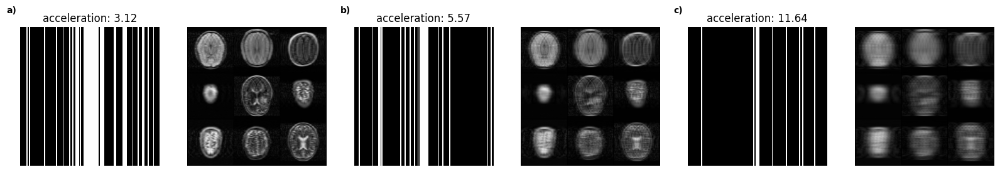
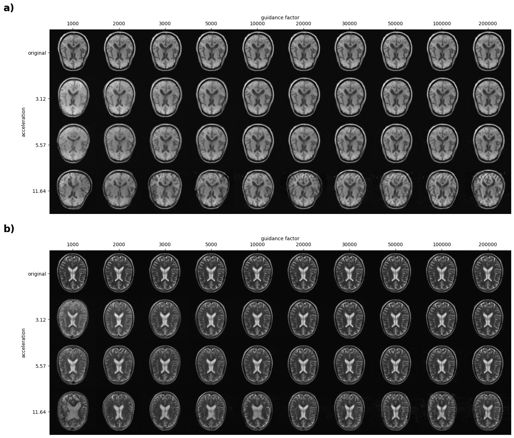

+++
title = 'Diffusion Models for Linear Inverse Problems'
author = 'Lionel Peer'
date = 2024-06-11T09:55:33+02:00
draft = true
+++
In the fall of 2023 I worked on inverse problems in medical imaging with diffusion models (download the thesis PDF [here](https://github.com/liopeer/CVLThesis/blob/main/main.pdf)). This was part of a semester thesis at ETH Zurich and the problem at hand was the reconstruction of MRI (magnetic resonance imaging) acquistions from sparse k-space measurements. For those unfamiliar with how MRI works: Imagine a slice through the human body -- a pixelized image -- on which you now apply the 2D DFT (discrete Fourier transform) using the *spatial frequencies* $k$. This Fourier representation of the image is exactly what MRI acquires and we usually call it $k$-space, in reference to those spatial frequencies. Acquisition protocols in MRI usually sequentially sample vertical (or horizontal) lines in this k-space and only sampling a sparse subset of those lines has the potential to significantly speed-up acquisitions.
## Linear Forward Models
A linear forward model is any model that linearizes the acquisition, i.e. a linear map is assumed from the real object to the acquisition. As we already discussed, MRI is acquired in k-space, therefore with $\bm{x}$ the object, $\bm{y}$ the acquistion, the forward model is simply
$$
\begin{equation}
\bm{y} = \mathcal{F}(\bm{x})
\end{equation}
$$
and since the Fourier transform is linear, this is in fact a *linear forward model*. Similar models exist for tomographic imaging (e.g. CT), where the object is mapped to a *sinogram* by a linear transform called [*Radon transform*](https://en.wikipedia.org/wiki/Radon_transform).
## Subsampling K-Space
As information is concentrated in the center regions of k-space for natural images, it makes sense to fully sample those regions and constrain the undersampling to higher frequencies. Several examples of such undersampling masks and their effects on the images are shown in below figure. White parts of the masks are regions of k-space that we sample and since this sampling scheme acts like superpositions of box filters, we see heavy ringing artifacts and aliasing that gets progressively worse with more aggressive undersampling.

## The Inspiration: Classifier Guidance
The score-based formulation of diffusion models assumes that with every iterative step, we take a gradient ascent step to maximize our log-likelihood function
$$
\begin{equation}
x_{t+1} = x_{t} + \nabla_{x_t} \log p_\theta (x_t).
\end{equation}
$$
Dhariwal et al.[^1] subsequently derived a formulation for maximizing the joint log-likelihood $\log p(x,c)$, where $c$ is an image class (like *dog*, *car* etc.).
$$
\begin{align}
\nabla_{x_t} \log p_\theta(x_t, c) &= \nabla_{x_t} \log p_\theta(x_t) p(c|x_t)\\
&= \nabla_{x_t} \log p_\theta(x_t) + \nabla_{x_t} \log p(c|x_t)
\end{align}
$$
The update step therefore becomes:
$$
\begin{equation}
x_{t+1} = x_{t} + \nabla_{x_t} \log p_\theta(x_t) + \nabla_{x_t} \log p(c|x_t)
\end{equation}
$$
The first term is simply the update step of the diffusion model and the second is a log-likelihood of a certain class, given the current noisy prediction. This likelihood can e.g. be evaluated using a neural network classifier as Dhariwal et al. did in their paper and termed this *classifier guidance*. This procedure not only allowed conditional sampling from an unconditional diffusion model, but also enabled much higher sample fidelity by combining it with standard conditioning.

## The Idea: Loss Guidance
Assuming we don't want our image to be of a certain class, but instead we want its k-space to correspond to the sampled k-space lines $s$, filling unsampled lines by its prior knowledge. This leads to the formulation
$$
\begin{equation}
x_{t+1} = x_{t} + \nabla_{x_t} \log p_\theta(x_t) + \nabla_{x_t} \log p(s|x_t)
\end{equation}
$$
where we know that we can optimize for the log-likelihood under Gaussian noise by the MSE (mean square error) loss (see [this post]()), giving us the formulation of *loss guidance*
$$
\begin{equation}
x_{t+1} = x_{t} + \nabla_{x_t} \log p_\theta(x_t) + MSE(\mathcal{M}\circ \mathcal{F}(s), \mathcal{M}\circ \mathcal{F}(x_t))
\end{equation}
$$
where the operations $\mathcal{M}$ and $\mathcal{F}$ are the Fourier transform and the masking.
### Practical Results
Dhariwal et al.[^1] add a *guidance factor* in practice that allows driving the maximization more towards high likelihoods of the prior (diffusion model) or the classifier. With loss guidance this is of course also possible and in below figure you can see a table that includes reconstructions using several guidance factors and undersampling factors (*acceleration*), proving that the method works really well.

## The Disillusion: Solving Inverse Problems in Medical Imaging with Score-Based Generative Models
Only a few days before handing in my thesis, I had to realize that Song et al.[^2] had already tackled the problem that I was trying to solve.

[^1]: Dhariwal, Prafulla, and Alexander Nichol. "Diffusion models beat gans on image synthesis." Advances in neural information processing systems 34 (2021): 8780-8794.
[^2]: Song, Yang, et al. "Solving inverse problems in medical imaging with score-based generative models." arXiv preprint arXiv:2111.08005 (2021).